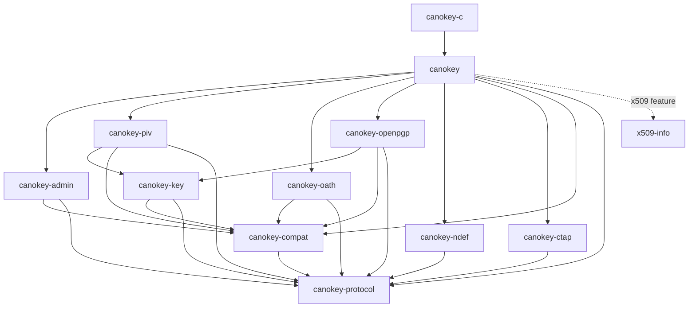

# libcanokey

[](https://github.com/canokeys/libcanokey/actions/workflows/ci.yml)

A Rust host protocol library for CanoKey. It produces APDUs and consumes complete
responses; callers own transport, connections and application state. The C ABI is
experimental. There is no runtime, credential cache or mutable global state.

## Crates

Rust applications use **`canokey`**; C applications link **`canokey-c`**. A Console
FRB adapter would call the Rust facade directly.

| Crate | Responsibility | Workspace dependencies |
| --- | --- | --- |
| `canokey-protocol` | APDU/TLV, owned operations, continuation/chaining, limits, errors, secret buffers | None |
| `canokey-compat` | Immutable profiles, capability evidence, firmware rules and algorithm IDs | protocol |
| `canokey-key` | Shared public-key TLV fields and pure SPKI export | protocol, compat |
| `canokey-admin` | Admin reads, configuration, PIN and explicit resets | protocol, compat |
| `canokey-piv` | PIV operations and certificate container parsing | protocol, compat, key |
| `canokey-oath` | OATH access, credentials and full/truncated calculations | protocol, compat |
| `canokey-openpgp` | OpenPGP data, passwords, policies and key operations | protocol, compat, key |
| `canokey-ndef` | NDEF capability reads and crash-consistent message writes | protocol |
| `canokey-ctap` | CTAP/FIDO2 ISO 7816 transport envelope and CTAP2 client (ClientPIN, credential management) | protocol |
| `canokey` | Facade and device probing | protocol, compat, admin, piv, oath, openpgp, ndef, ctap |
| `canokey-c` | Copied C descriptors and results, operation dispatch | canokey |

Arrows point from each crate to its dependencies; the dashed edge is optional.



The facade optionally re-exports the independent crates.io package
[`x509-info`](https://github.com/canokeys/x509-info) 0.1.1. PIV unwraps a certificate
container; X.509 inspection is a separate pure call. Probe orchestration belongs in
the facade so compat never depends on applet crates. Bindings do not duplicate
protocol state.

## Available features

- Minimal/PIV probing; firmware and PIV version separation; observed algorithm IDs,
  explicit Supported/Unsupported/Unknown evidence and narrow legacy quirks.
- Admin identity/storage/configuration reads, PIN, NFC/NDEF, CTAP SM2 configuration
  and explicit applet/device resets; configuration patches retain confirmed writes on failure.
  `admin::operation_with_access` adds an explicit selected-context policy
  (`Access::Existing`) that reuses the caller's selected Admin transaction
  without SELECT or implicit VERIFY. Typed PASS slots read both touch slots
  (Off/Static/HmacSha1/Oath/Unknown) and write Off, static-password or
  HMAC-SHA1 configurations; OATH slots stay with the OATH applet.
- OATH SELECT/access-code validation, PBKDF2 password derivation, credential CRUD,
  full/truncated calculations and paged results with explicit HOTP/touch markers.
  Set-default marks an HOTP credential as the touch keyboard-emulation default,
  using the two-slot/append-enter dialect only on firmware 3.0.0 and newer.
  The vendor extension commands the OATH applet answers (GET SERIAL and
  HMAC-SHA1 challenge-response from a PASS slot, dispatched before the
  access-validation gate) provide the KeePassXC interop path; they require
  3.1.0 firmware evidence.
- NDEF capability-container reads and chunked message read/replace, with
  zero-NLEN-first crash-consistent writes; profile-free.
- CTAP/FIDO2 ISO 7816 transport envelope (explicit FIDO2 selection, `80 10`
  message wrap and `80 C0` GET RESPONSE continuation) plus a typed CTAP2
  client layer: strict canonical CBOR, COSE key and authenticatorData parsing,
  and getInfo/makeCredential/getAssertion/reset/selection operations. The
  default `clientpin` feature adds ClientPIN protocols 1 and 2, credential
  management with bounded in-operation enumeration, authenticatorConfig
  (toggle always-UV, set minimum PIN length, require long touch for reset)
  and fragmented largeBlobs reads/writes. The raw CTAP1/U2F
  register/authenticate/check-only/version commands are ungated, and the
  hmac-secret extension covers the makeCredential declaration plus the
  encrypted salt exchange, including the CanoKey hmac-secret-mc variant.
  WebAuthn ceremonies (clientDataJSON, attestation trust, rpId policy)
  remain host-side.
- OpenPGP DO/certificate reads and writes, separate PW1/PW3 modes, password/reset
  management, explicit policies/fingerprints/timestamps, key generation/import,
  shared SPKI export, signatures, PKCS#1 v1.5 decipher and ECDH/X25519.
- PIV selection, PIN status/verification/logout, PIN/PUK changes and unblock.
- External/Mutual 3DES or AES-192 management authentication, explicit caller-supplied
  mutual challenges; authenticated object/certificate writes and management-key replacement.
  PIN-managed protection validation/finalization owns policy parsing, recovered-key
  authentication and explicit PUK blocking. Key rotation can maintain PRINTED.
- Object/certificate reads, bounded gzip decoding, certificate deletion, metadata
  and algorithm-configuration reads; compact directory with entry diagnostics,
  UTF-16 container names, key move/delete, explicit PIN/PUK retry reset, algorithm
  configuration replacement, attestation DER and explicit reset of blocked PIV.
- Key generation/import and public-key SPKI export. Scalar import supports
  P-256/P-384/P-521/secp256k1/SM2; RSA CRT and Ed25519/X25519/ML seeds are typed inputs.
- Classic RSA/ECDSA/SM2/Ed25519 signing, original signature encoding and DER/P1363
  conversion; explicit ML-DSA (empty context), randomized Ed25519 and SM2 full-message
  streaming signing, including empty messages; raw RSA decryption,
  P-256/P-384/P-521/secp256k1 ECDH, X25519 derivation, ML-KEM-768 decapsulation
  and SM2 agreement with pre-exchanged peer keys. Classic PIV hashing/padding and
  postprocessing KDF remain caller responsibilities.
- Explicit Batch requests under one SELECT, with completed results retained after
  a later failure; corresponding C factories and indexed result getters.

Firmware compatibility covers audited 1.3–3.1.0 layouts with per-operation gates.
Legacy OATH commands, OpenPGP DO framing and Admin configuration fields are selected
from actual Admin firmware; unknown base versions do not enable mutations; development builds follow their
declared numeric base version while preserving the original version text.
See [compatibility contracts](docs/design/api-design.md#profiles-and-probing) for the model
and each applet's historical restrictions. Every factory checks required evidence. PIV `sign_streaming`
handles ML-DSA and empty Ed25519 messages explicitly; SM2 initiators require PIN
Never/Once and peer keys supplied at construction. See [plan](plan.md) for firmware
limitations and remaining hardware validation. Validation uses pinned sources and offline
transcripts; hardware checks and consumer integration remain separate.

## Examples

Install rustup; the repository selects Rust 1.85.1 (MSRV 1.85). All examples use
synthetic offline transcripts and check emitted commands. Test credentials,
challenges and certificate payloads are fixtures, not production inputs.

| Example | Demonstrates |
| --- | --- |
| [historical](crates/canokey/examples/historical.rs) | Firmware 1.3 OATH LIST and profile-aware OpenPGP field parsing |
| [openpgp](crates/canokey/examples/openpgp.rs) | Observed key attributes, explicit PW1-sign and owned signature |
| [oath](crates/canokey/examples/oath.rs) | Caller-supplied TOTP time step and owned code bytes |
| [admin](crates/canokey/examples/admin.rs) | Explicit PIN and configuration patch under one SELECT |
| [probe](crates/canokey/examples/probe.rs) | Caller-owned device profile |
| [read_certificate](crates/canokey/examples/read_certificate.rs) | Operation and result lifetimes |
| [write_certificate](crates/canokey/examples/write_certificate.rs) | Mutual authentication followed by PUT DATA |
| [decapsulate](crates/canokey/examples/decapsulate.rs) | Algorithm discovery, PIN, chained ML-KEM ciphertext and owned secret |
| [sign_streaming](crates/canokey/examples/sign_streaming.rs) | Explicit randomized Ed25519 signing of an empty message |
| [batch](crates/canokey/examples/batch.rs) | Successful preceding results after a later failure |
| [C probe](crates/canokey-c/examples/probe.c) | Size queries, profile transfer and cleanup |

```sh
cargo run -p canokey --example admin --locked
cargo run -p canokey --example oath --locked
cargo run -p canokey --example openpgp --locked
cargo run -p canokey --example batch --locked
bash scripts/run-c-example.sh
```

Replace the [example executor's](crates/canokey/examples/support/mod.rs) fixture
exchange with raw application I/O. Hold one connection lease across the operation;
supply complete responses including SW1/SW2 and disable transport retries/continuation.
Getters never send APDUs. On I/O failure, drop the operation and drain or isolate
pending I/O before connection reuse. Cancel/drop never roll back device effects.
Boundary sketches: [Console/Dart](docs/guides/console-integration.md),
[PKCS#11/C](docs/guides/pkcs11-integration.md).

## Certificate inspection

Enable `canokey/x509` for parsing, or `canokey/serde` for optional serialization.
Default builds omit the parser; applications choose their own serializers or FRB DTOs.

```rust,ignore
let info = canokey::x509::parse_der(certificate.der(), Default::default())?;
// With canokey/serde and the application's serde_json dependency:
let json = serde_json::to_string(&info.summary())?;
```

The [x509-info documentation](https://github.com/canokeys/x509-info) owns certificate
models, CLI formats and schema. Parsing does not verify certificate trust or validity.

## Build and validation

```sh
cargo fmt --all --check
cargo test --workspace --locked
cargo test --workspace --all-features --locked
cargo clippy --workspace --all-targets --all-features --locked -- -D warnings
RUSTDOCFLAGS="-D warnings" cargo doc --workspace --all-features --no-deps --locked
cargo build --workspace --locked
cargo build -p canokey --all-features --target wasm32-unknown-unknown --locked
python3 scripts/check-dependencies.py
python3 scripts/check-licenses.py
bash scripts/test-c-abi.sh
```

CI checks native/wasm builds, examples, doctests, strict rustdoc/clippy, dependency
boundaries, licenses and C/C++ linking. Open `target/doc/canokey/index.html` for
public API documentation. Cargo.lock is tracked; reference clones and build outputs
are ignored.

## Documentation and license

- [Documentation map](docs/README.md): design documents vs user guides, with an
  architecture overview.
- [API contracts](docs/design/api-design.md): ownership, execution and binding rules.
- [Plan](plan.md): remaining work and acceptance criteria.
- [Reference evidence](docs/design/references.md): pinned firmware and consumer sources.
- [Contributor instructions](AGENTS.md): language, architecture, checks and commits.

Copyright 2026 canokeys.org. Licensed under [Apache-2.0](LICENSE). Each workspace
crate inherits the metadata and includes a copy of the root license for packaging.
Third-party dependencies and reference repositories retain their own licenses.
